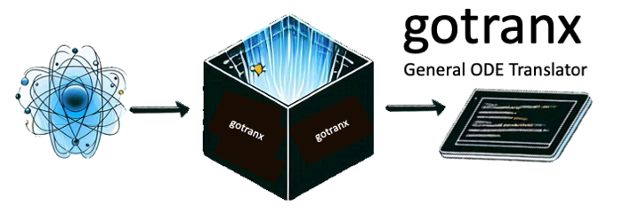

[](https://github.com/finsberg/gotranx/actions/workflows/pre-commit.yml)
[](https://github.com/finsberg/gotranx/actions/workflows/main.yml)
[](https://finsberg.github.io/gotranx)
[](https://opensource.org/licenses/MIT)
[](https://github.com/psf/black)
[](https://codspeed.io/finsberg/gotranx)

# gotranx

`gotranx` is the next generation General ODE translator and is an attempt to a full rewrite of [gotran](https://github.com/ComputationalPhysiology/gotran).

The general idea is that you write your ODE in a high level markup language and use `gotranx` to generate code for solving the ODE in different programming languages.

At the moment we only support Python and C, but we plan to support a wide range of programming languages in the future.

`gotranx` uses [`sympy`](https://www.sympy.org/en/index.html) to generate the numerical schemes.

- Source code: https://github.com/finsberg/gotranx
- Documentation: https://finsberg.github.io/gotranx/


## Install
Install with pip
```
python3 -m pip install gotranx
```
or for the development version
```
python3 -m pip install git+https://github.com/finsberg/gotranx
```

## Quick start
Check out the demos in the [documentation](https://finsberg.github.io/gotranx/)


## License
MIT

## Contributing
Contributions are very welcomed, but please read the [contributing guide](https://finsberg.github.io/gotranx/CONTRIBUTING.html) first
