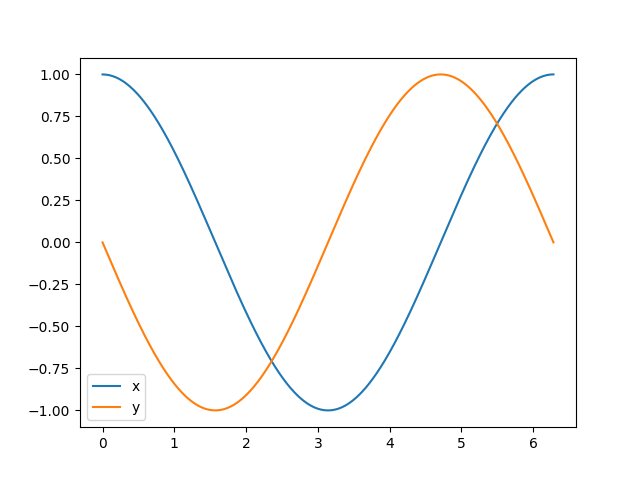

[](https://github.com/finsberg/gotranx/actions/workflows/pre-commit.yml)
[](https://github.com/finsberg/gotranx/actions/workflows/main.yml)
[](https://finsberg.github.io/gotranx)
[](https://opensource.org/licenses/MIT)
[](https://github.com/psf/black)
[](https://codspeed.io/finsberg/gotranx)
[](https://joss.theoj.org/papers/40dc8d8287c6188eaab8149ed3bfe60b)
[](https://doi.org/10.5281/zenodo.13940990)

# gotranx

`gotranx` is the next generation General ODE translator. The general idea is that you write your ODE in a high level markup language and use `gotranx` to generate code for solving the ODE in different programming languages.  `gotranx` uses [`sympy`](https://www.sympy.org/en/index.html) to create a symbolic representation of the ODE which is used to generate the jacobian and numerical schemes.


`gotranx` makes it also possible generate code from `e.g` [CellML models](https://models.physiomeproject.org/cellml) using conversion tools from [`myokit`](https://github.com/myokit/myokit).

- Source code: https://github.com/finsberg/gotranx
- Documentation: https://finsberg.github.io/gotranx/


## Install
Install with pip
```
python3 -m pip install gotranx
```
or for the development version
```
python3 -m pip install git+https://github.com/finsberg/gotranx
```

You can also install `gotranx` using conda
```
conda install -c conda-forge gotranx
```

## Quick start
Define your ODE in a `.ode` file, e.g `file.ode` with the content
```
states(x=1, y=0)
parameters(a=1.0)

dx_dt = a * y
dy_dt = -x
```
which defines the ODE system

$$
\begin{align}
\frac{dx}{dt} &= ay \\
\frac{dy}{dt} &= -x
\end{align}
$$

with the initial conditions $x(0) = 1$ and $y(0) = 0$ and the parameter $a$ with a value of 1.0. Now generate code in python for solving this ODE with the explicit euler scheme using the command
```
gotranx ode2py file.ode --scheme explicit_euler -o file.py
```
which will create a file `file.py` containing functions for solving the ODE. Now you can solve the ode using the following code snippet

```python
import file as model
import numpy as np
import matplotlib.pyplot as plt

s = model.init_state_values()
p = model.init_parameter_values()
dt = 1e-4  # 0.1 ms
T = 2 * np.pi
t = np.arange(0, T, dt)

x_index = model.state_index("x")
x = [s[x_index]]
y_index = model.state_index("y")
y = [s[y_index]]

for ti in t[1:]:
    s = model.explicit_euler(s, ti, dt, p)
    x.append(s[x_index])
    y.append(s[y_index])

plt.plot(t, x, label="x")
plt.plot(t, y, label="y")
plt.legend()
plt.show()
```


Alternatively, you can use a third-party ODE solver, e.g [`scipy.integrate.solve_ivp`](https://docs.scipy.org/doc/scipy/reference/generated/scipy.integrate.solve_ivp.html) to solve the ODE by passing in the right-hand side function

```python
import file as model
from scipy.integrate import solve_ivp
import numpy as np
import matplotlib.pyplot as plt

s = model.init_state_values()
p = model.init_parameter_values()
dt = 1e-4  # 0.1 ms
T = 2 * np.pi
t = np.arange(0, T, dt)

res = solve_ivp(
    model.rhs,
    (0, T),
    s,
    method="RK45",
    t_eval=t,
    args=(p,),
)

plt.plot(res.t, res.y.T)
plt.legend()
plt.show()
```

Note that this is a rather artificial example, so check out the demos in the [documentation](https://finsberg.github.io/gotranx/) for more elaborate examples.

## FAQ

**Why should I use `gotranx`?**
The main reasons to use `gotranx` are

1. You want to solve your model using different programming languages (e.g python and C)
2. You want to create a custom numerical scheme that can utilize the symbolic representation of the ODE
3. You would like to share your model in a high level representation (i.e a markup language)


**How does it differ from `scipy.integrate.solve_ivp`?**
`scipy.integrate.solve_ivp` is an ODE solver which takes as input a function defining the right-hand. `gotranx` takes a high level representation of the ODE and can generate code for the right hand side. In other words, you can use `scipy.integrate.solve_ivp` to solve the ODE and use `gotranx` to generate the right hand side.


## Automated tests

### Unit tests
Automated tests can be found in the [`test`](https://github.com/finsberg/gotranx/tree/main/tests) folder. To the run the tests please install the test dependencies
```
python3 -m pip install "gotranx[test]"
```
or if you have cloned the repo locally you can do
```
python3 -m pip install ".[test]"
```
To run the tests you should execute the following command
```
python3 -m pytest
```
Also note that the tests are run on every push and pull request to `main` using [GitHub actions](https://github.com/finsberg/gotranx/actions).

### Linting and formatting
We use [`pre-commit`](https://pre-commit.com) to run the a set of linters and formatters in order to ensure consistent code style. Developers should install the [pre-commit hooks](https://github.com/finsberg/gotranx/blob/main/.pre-commit-config.yaml) by first installing `pre-commit`
```
python3 -m pip install pre-commit
```
and then install the pre-commit hooks
```
pre-commit install
```
To run the hooks on all the files you can do
```
pre-commit run --all
```
For further instructions see the [contributing guide](https://finsberg.github.io/gotranx/CONTRIBUTING.html).

Note also the we run all hooks as a part of our [continuous integration](https://github.com/finsberg/gotranx/actions/workflows/pre-commit.yml), and we are also using [pre-commit.ci](https://pre-commit.ci) to update branches automatically that can fix issues automatically.

### Performance monitoring
We have defined a set of benchmarks that run on every push to the `main` branch using [codspeed](https://codspeed.io). To monitor the performance over time you can check out the [performance report](https://codspeed.io/finsberg/gotranx).

To run the benchmarks locally you can install the `pytest-codspeed` plugin
```
python3 -m pip install pytest-codspeed
```
and run
```
python3 -m pytest tests/ --codspeed
```
You can find more info at https://docs.codspeed.io/benchmarks/python

## Citing
If you use `gotranx` in your research project we would appreciate if you could use the following citation
```
@article{Finsberg2024,
    doi = {10.21105/joss.07063},
    url = {https://doi.org/10.21105/joss.07063},
    year = {2024},
    publisher = {The Open Journal},
    volume = {9},
    number = {102},
    pages = {7063},
    author = {Henrik Finsberg and Johan Hake},
    title = {gotranx: General ODE translator},
    journal = {Journal of Open Source Software}
}
```

## License
MIT

## Contributing
Contributions are very welcomed, but please read the [contributing guide](https://finsberg.github.io/gotranx/CONTRIBUTING.html) first
