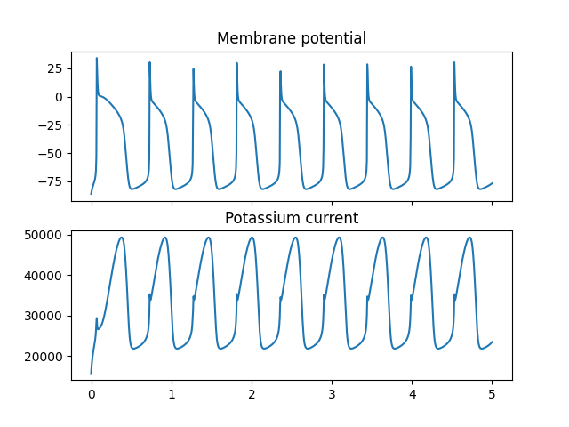

# Command line interface

The primary usage of `gotranx` is through the command line interface. For this demonstration we will use a pre-made model that is hosted in the [CellML repository](https://models.physiomeproject.org/cellml). In particular we will be using the original [Noble model from 1962](https://models.physiomeproject.org/e/2a6/noble_1962.cellml/view) which is probably one of the simplest models for modeling cardiac cells.

First we download the model from the CellML repository either by cloning the git repo
```{ .sh .copy}
git clone https://models.physiomeproject.org/workspace/noble_1962
```
vising the [model page](https://models.physiomeproject.org/e/2a6/noble_1962.cellml/view) and downloading the model manually.
Once downloaded you will find the following files
```{ .sh .no-copy}
├── noble_1962
│   ├── hodgkin_1952.png
│   ├── noble_1962.ai
│   ├── noble_1962.cellml
│   ├── noble_1962.sedml
│   ├── noble_1962.session.xml
│   ├── noble_1962.svg
│   └── noble_1962.xul
```
The model itself is defined in the `.cellml` file called `noble_1962.cellml`. The `cellml` format is a format similar to XML.

## Converting from `.cellml` to `.ode`

We will now convert the `.cellml` file to a `.ode` file using the following command
```{ .sh .copy }
python3 -m gotranx convert noble_1962.cellml --to .ode
```
which gives the following output
```{ .sh .no-copy}
$ python3 -m gotranx convert noble_1962.cellml --to .ode
2024-02-21 12:37:59 [info     ] Converting /Users/finsberg/local/src/gotran-parser/demo/noble_1962/noble_1962.cellml to gotran ode file
2024-02-21 12:37:59 [info     ] Wrote /Users/finsberg/local/src/gotran-parser/demo/noble_1962/noble_1962.ode
2024-02-21 12:37:59 [info     ] Wrote /Users/finsberg/local/src/gotran-parser/demo/noble_1962/noble_1962.ode
```
We see now that a new file `noble_1962.ode` has been created with the following content
```{ .py .no-copy }
states("membrane",
V=ScalarParam(-87, unit="mV", description="")
)

states("sodium_channel_h_gate",
h=ScalarParam(0.8, unit="1", description="")
)

states("sodium_channel_m_gate",
m=ScalarParam(0.01, unit="1", description="")
)

states("potassium_channel_n_gate",
n=ScalarParam(0.01, unit="1", description="")
)

parameters("membrane",
Cm=ScalarParam(12.0, unit="uF", description="")
)

parameters("leakage_current",
E_L=ScalarParam(-60.0, unit="mV", description=""),
g_L=ScalarParam(75.0, unit="uS", description="")
)

parameters("sodium_channel",
E_Na=ScalarParam(40.0, unit="mV", description=""),
g_Na_max=ScalarParam(400000.0, unit="uS", description="")
)

expressions("sodium_channel_h_gate")
alpha_h = 170.0*exp((-V - 1*90.0)/20.0) # S/F
beta_h = 1000.0/(exp((-V - 1*42.0)/10.0) + 1.0) # S/F
dh_dt = alpha_h*(1.0 - h) - beta_h*h

expressions("sodium_channel_m_gate")
alpha_m = (100.0*(-V - 1*48.0))/(exp((-V - 1*48.0)/15.0) - 1*1.0) # S/F
beta_m = (120.0*(V + 8.0))/(exp((V + 8.0)/5.0) - 1*1.0) # S/F
dm_dt = alpha_m*(1.0 - m) - beta_m*m

expressions("potassium_channel_n_gate")
alpha_n = (0.1*(-V - 1*50.0))/(exp((-V - 1*50.0)/10.0) - 1*1.0) # S/F
beta_n = 2.0*exp((-V - 1*90.0)/80.0) # S/F
dn_dt = alpha_n*(1.0 - n) - beta_n*n

expressions("potassium_channel")
g_K1 = 1200.0*exp((-V - 1*90.0)/50.0) + 15.0*exp((V + 90.0)/60.0) # uS
g_K2 = 1200.0*n**4.0 # uS
i_K = (V + 100.0)*(g_K1 + g_K2) # nA

expressions("sodium_channel")
g_Na = g_Na_max*(h*m**3.0) # uS
i_Na = (-E_Na + V)*(g_Na + 140.0) # nA

expressions("leakage_current")
i_Leak = g_L*(-E_L + V) # nA

expressions("membrane")
dV_dt = (-(i_Leak + (i_K + i_Na)))/Cm # mV
```

## Generating source code
Now that we have a `.ode` file we can use this to generate source code in python that can be used to solve the ODE. To to this we can use the command

=== "Python"
    ```{ .sh .copy }
    python3 -m gotranx convert noble_1962.ode --to .py
    ```

=== "C"
    Either to at `.c` file
    ```{ .sh .copy }
    python3 -m gotranx convert noble_1962.ode --to .c
    ```
    or to a `.h` file
    ```{ .sh .copy }
    python3 -m gotranx convert noble_1962.ode --to .h
    ```

This will generate a source code file for the given extension, containing the following functions

- `parameter_index`
- `state_index`
- `monitor_index`
- `init_parameter_values`
- `init_states_values`
- `rhs`
- `monitor`

You will find more information about the different functions further down in this document.

In the case of Python the source code will be saved in a file called `noble_1962.py`, and we could use this code as follows

```{ .py .copy}
import noble_1962 as model
import numpy as np
from scipy.integrate import solve_ivp
import matplotlib.pyplot as plt

T = 5  # Unit is in seconds

# Get default initial state values but add a custom value for V
y = model.init_state_values(V=-86)
# Get default parameter values but add a custom value for Cm
p = model.init_parameter_values(Cm=11)
t = np.linspace(0, T, 1000)

res = solve_ivp(model.rhs, (0, T), y, t_eval=t, method="Radau", args=(p,))

V_index = model.state_index("V")
i_K_index = model.monitor_index("i_K")

monitor = model.monitor(res.t, res.y, p)
i_K = monitor[i_K_index, :]

fig, ax = plt.subplots(2, 1, sharex=True)
ax[0].plot(res.t, res.y[V_index, :])
ax[0].set_title("Membrane potential")
ax[1].plot(res.t, i_K)
ax[1].set_title("Potassium current")
fig.savefig("noble_1962.png")
```

Which will produce the following figure


Here we have also used [`scipy.integrate.solve_ivp`](https://docs.scipy.org/doc/scipy/reference/generated/scipy.integrate.solve_ivp.html) for solving the initial value problem.


### Generating schemes for ODE
In the example above we only generated the right hand side (function `rhs`) which can be passed `solve_ivp`, but it might be more appropriate to use a specific numerical scheme for solving the ODE. One example of a numerical scheme is the *forward euler*  scheme. Another popular scheme for solving cardiac cell models is the [Generalized Rush Larsen scheme](https://doi.org/10.1109/TBME.2009.2014739).

We can generate this scheme using the following command
```{ .sh .copy}
python3 -m gotranx noble_1962.ode --to .py --scheme forward_generalized_rush_larsen
```

The file `noble_1962.py` will now also contain the function
```python
def forward_generalized_rush_larsen(states, t, dt, parameters): ...
```

and we can now solve the problem with the following program
```{ .py .copy }
import noble_1962 as model
import numpy as np
import matplotlib.pyplot as plt

y = model.init_state_values()
p = model.init_parameter_values()
dt = 1e-4  # 0.1 ms
T = 5
t = np.arange(0, T, dt)

V_index = model.state_index("V")
V = [y[V_index]]

for ti in t[1:]:
    y = model.forward_generalized_rush_larsen(y, ti, dt, p)
    V.append(y[V_index])

plt.plot(t, V)
plt.show()
```


## Overview of functions

### `parameter_index`

Function to get the index of a parameter

=== "Python"

    ```python
    def parameter_index(name: str) -> int:
        """Return the index of the parameter with the given name

        Arguments
        ---------
        name : str
            The name of the parameter

        Returns
        -------
        int
            The index of the parameter

        Raises
        ------
        KeyError
            If the name is not a valid parameter
        """

        data = {"Cm": 0, "E_L": 1, "E_Na": 2, "g_L": 3, "g_Na_max": 4}
        return data[name]
    ```

=== "C"

    ```C
    // Parameter index
    int parameter_index(const char name[])
    {

        if (strcmp(name, "Cm") == 0)
        {
            return 0;
        }

        else if (strcmp(name, "E_L") == 0)
        {
            return 1;
        }

        else if (strcmp(name, "E_Na") == 0)
        {
            return 2;
        }

        else if (strcmp(name, "g_L") == 0)
        {
            return 3;
        }

        else if (strcmp(name, "g_Na_max") == 0)
        {
            return 4;
        }

        return -1;
    }
    ```


### `state_index`

Function to get the index of a state variable


=== "Python"

    ```python
    def state_index(name: str) -> int:
        """Return the index of the state with the given name

        Arguments
        ---------
        name : str
            The name of the state

        Returns
        -------
        int
            The index of the state

        Raises
        ------
        KeyError
            If the name is not a valid state
        """

        data = {"h": 0, "m": 1, "n": 2, "V": 3}
        return data[name]
    ```


=== "C"

    ```C
    // State index
    int state_index(const char name[])
    {

        if (strcmp(name, "h") == 0)
        {
            return 0;
        }

        else if (strcmp(name, "m") == 0)
        {
            return 1;
        }

        else if (strcmp(name, "n") == 0)
        {
            return 2;
        }

        else if (strcmp(name, "V") == 0)
        {
            return 3;
        }

        return -1;
    }
    ```


### `monitor_index`

Function to get the index of a monitor or intermediate variable


=== "Python"

    ```python
    def monitor_index(name: str) -> int:
        """Return the index of the monitor with the given name

        Arguments
        ---------
        name : str
            The name of the monitor

        Returns
        -------
        int
            The index of the monitor

        Raises
        ------
        KeyError
            If the name is not a valid monitor
        """

        data = {
            "alpha_h": 0,
            "alpha_m": 1,
            "alpha_n": 2,
            "beta_h": 3,
            "beta_m": 4,
            "beta_n": 5,
            "g_K1": 6,
            "g_K2": 7,
            "g_Na": 8,
            "i_Leak": 9,
            "dh_dt": 10,
            "dm_dt": 11,
            "dn_dt": 12,
            "i_K": 13,
            "i_Na": 14,
            "dV_dt": 15,
        }
        return data[name]
    ```


=== "C"

    ```C
    // Monitor index
    int monitor_index(const char name[])
    {

        if (strcmp(name, "alpha_h") == 0)
        {
            return 0;
        }

        else if (strcmp(name, "alpha_m") == 0)
        {
            return 1;
        }

        else if (strcmp(name, "alpha_n") == 0)
        {
            return 2;
        }

        else if (strcmp(name, "beta_h") == 0)
        {
            return 3;
        }

        else if (strcmp(name, "beta_m") == 0)
        {
            return 4;
        }

        else if (strcmp(name, "beta_n") == 0)
        {
            return 5;
        }

        else if (strcmp(name, "g_K1") == 0)
        {
            return 6;
        }

        else if (strcmp(name, "g_K2") == 0)
        {
            return 7;
        }

        else if (strcmp(name, "g_Na") == 0)
        {
            return 8;
        }

        else if (strcmp(name, "i_Leak") == 0)
        {
            return 9;
        }

        else if (strcmp(name, "dh_dt") == 0)
        {
            return 10;
        }

        else if (strcmp(name, "dm_dt") == 0)
        {
            return 11;
        }

        else if (strcmp(name, "dn_dt") == 0)
        {
            return 12;
        }

        else if (strcmp(name, "i_K") == 0)
        {
            return 13;
        }

        else if (strcmp(name, "i_Na") == 0)
        {
            return 14;
        }

        else if (strcmp(name, "dV_dt") == 0)
        {
            return 15;
        }

        return -1;
    }
    ```
