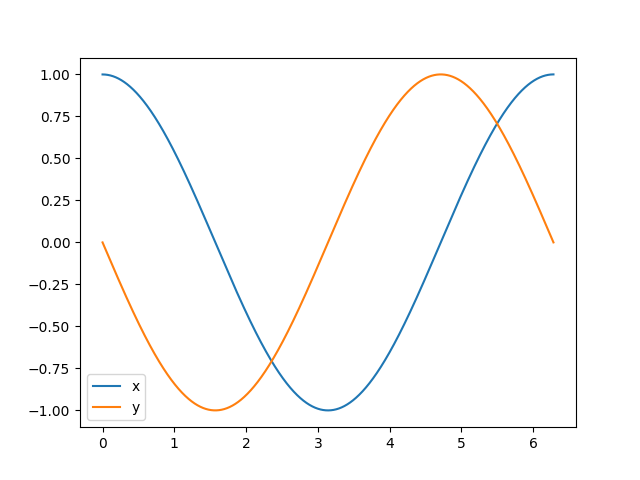

# Summary

We introduce `gotranx`, a General ODE Translator for automatic code generation of ordinary differential equations (ODEs). The user writes the ODE in a markup language with the file extension `.ode` and the tool generates code with numerical schemes for solving the ODE in different programming languages.

`gotranx` implements a domain specific language (DSL) using [Lark](https://github.com/lark-parser/lark) for representing ODEs. It can parse the variables and equations into a symbolic representation [@meurer2017sympy], and generate numerical schemes based on codeprinters from Sympy, in particular the Rush-Larsen scheme [@rush1978practical] which is very popular in the field of computational biology.


`gotranx` is a full re-implementation of [`gotran`](https://github.com/ComputationalPhysiology/gotran), and the long term goal is to implement the same features in `gotranx` as found in `gotran` along with additional features.

# Statement of need

Systems of ordinary Differential Equations (ODEs) are equations of the form
$$
y'(t) = f(t, y),
$$
where $t$ represents time and $y$ is a vector of state variables. These equations are a fundamental concept in mathematics and science, and plays a critical role in various fields such as physics, engineering, and economics.

Solving ODEs can be done analytically in simple cases but for most real world applications one needs to apply numerical methods [@ascher1998computer]. For this there exist a suite of well established softwares such as `scipy` [@virtanen2020scipy] for Python, `Differentialequations.jl` [@rackauckas2017differentialequations] for Julia and Sundials [@hindmarsh2005sundials] for `C` and `C++` .

Computational biology is one field where ODEs play an essential role, for example in models of heart cells. The resulting ODEs can, in these cases, be quite involved with many parameters and state variables. For example, one of the more recent models of human heart cells [@tomek2019development] have 112 parameters, 45 state variables and 276 intermediate variables. Solutions of the state equations of these membrane models typically allows for specialized exponential integrators [@rush1978practical] that are implemented as a numerical scheme in `gotranx`.

Furthermore, such models of a single heart cell are typically embedded into a spatial model, such as the Monodomain or Bidomain model [@sundnes2007computing], where each point in a 3D geometry represents a cell. This means that thousands or even millions of such ODEs needs to be coupled and solved in a larger systems. In these cases, traditional solvers are usually unsuitable and custom code are often developed to solve the ODEs. An alternative to this approach is to use an existing framework specialized for these types of problems [@cooper2020chaste; @plank2021opencarp]. However, introducing a big framework might not be ideal if the user wants to do a lot of customizations. With `gotranx` you can easily generate framework independent code that can easily be integrated into most simulation pipelines. One example is [`fenics-beat`](https://github.com/finsberg/fenics-beat) [@Finsberg_fenics-beat_2024] which uses `gotranx` to generate code solving ODEs in a Monodomain model.

While such a models are typically developed in one programming language, different research groups use different programming languages to integrate and solve their models. To make these models programming language independent, it is common practice to write them in a markup language [@lloyd2004cellml; @keating2020sbml]. However, when translating the models to a new programming language, user typically need to do this manually which are likely to introduce errors in the code. Since `gotranx` also implements converters for e.g CellML through MyoKit [@clerx2016myokit], it already supports most models that are used today.

`gotranx` is a full rewrite of [`gotran`](https://github.com/ComputationalPhysiology/gotran) which was first developed back in 2012 primarily for generating code for solving problems in cardiac electrophysiology. `gotran` is very tightly coupled to [`sympy`](https://www.sympy.org/en/index.html) and at one point we were unable to upgrade the version of `sympy` which drastically limits its usage. This was the main motivation for the upgrade. You can read more about this background in the [documentation](https://finsberg.github.io/gotranx/docs/history.html).

## Features
The core idea behind `gotranx` is

1. to define your ODE in a high level language (so called `.ode` file), and
2. to generate code for solving the ODE in different programming languages

The `.ode` format is text based and high level stripped for details. For example the following `.ode` file
```
states(x=1, y=0)
parameters(a=1.0)

dx_dt = a * y
dy_dt = -x
```
defines the ODE system

$$
\begin{aligned}
\frac{dx}{dt} &= ay \\
\frac{dy}{dt} &= -x
\end{aligned}
$$

with the initial conditions $x(0) = 1$ and $y(0) = 0$ and the parameter $a$ with a value of 1.0. We can now generate code for solving the ODE using the Generalized Rush-Larsen scheme [@sundnes2009second] with the following command (assuming you wrote the ODE in the file `file.ode`)
```
gotranx ode2py file.ode --scheme generalized_rush_larsen -o file.py
```
which will output the code a new python file named `file.py`. We can now use this code as follows to solve the ODE
```python
import file as model
import numpy as np
import matplotlib.pyplot as plt

s = model.init_state_values()
p = model.init_parameter_values()
dt = 1e-4  # 0.1 ms
T = 2 * np.pi
t = np.arange(0, T, dt)

x_index = model.state_index("x")
x = [s[x_index]]
y_index = model.state_index("y")
y = [s[y_index]]

for ti in t[1:]:
    s = model.generalized_rush_larsen(s, ti, dt, p)
    x.append(s[x_index])
    y.append(s[y_index])

plt.plot(t, x, label="x")
plt.plot(t, y, label="y")
plt.legend()
plt.show()
```
{ width = 50% }


At the time of writing, `gotranx` support code generation to C and Python, with backends for [`numpy`](https://numpy.org) and [`jax`](https://jax.readthedocs.io/). It also supports conversion to and from [CellML](https://www.cellml.org) via [MyoKit](https://myokit.org). For a list of all features and the roadmap, please checkout the [roadmap](https://finsberg.github.io/gotranx/docs/roadmap.html).


# Acknowledgements
Henrik Finsberg is the main developer of `gotranx`. The original gotran library was created by Johan Hake, and he is acknowledged with co-authorship for this.
We would also like to acknowledge Kristian Hustad for valuable discussions and contributions to the original gotran library. This work has been financially supported by Simula Research Laboratory.

# References
